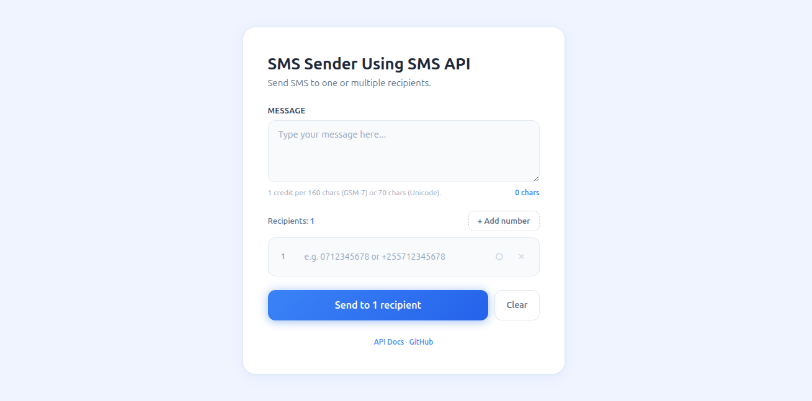
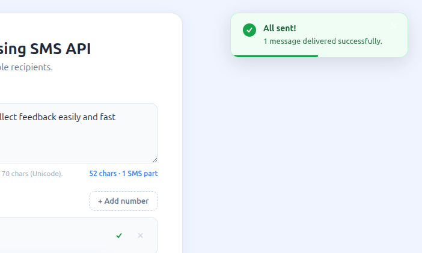
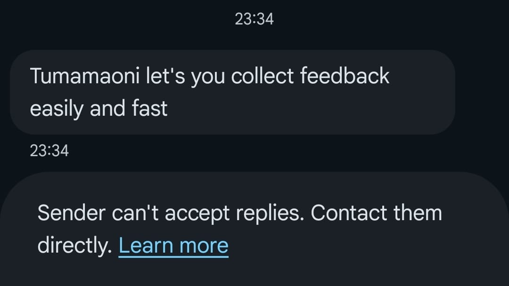

# SMS Sender PHP

A clean, lightweight PHP toolkit for sending SMS messages via the [SendAfrica API](https://docs.sendafrica.online). Send to one or multiple recipients with a polished web UI — no frameworks required.



### Multi-Recipient Support

Send the same message to multiple numbers at once. Add as many recipients as you need, each with its own live status indicator.



### Delivered Message

See the SMS arrive on the recipient's phone — what they receive looks like this:



## Features

- Send SMS to single or multiple recipients at once
- Real-time character counter with SMS part detection (GSM-7 / Unicode)
- Live per-recipient status (pending, sending, sent, failed)
- Animated progress bar during bulk sends
- Toast notifications for success/failure feedback
- Glowing blue button with loading spinner
- Clean white UI — mobile responsive
- API key stored in `.env` (never hardcoded)

## Quick Start

### Step 1 — Install XAMPP

1. Go to [apachefriends.org](https://www.apachefriends.org)
2. Download XAMPP for your OS (Windows / Mac / Linux)
3. Install with default settings
4. Open **XAMPP Control Panel** and click **Start** next to Apache

### Step 2 — Download this project

1. Click the green **Code** button at the top of this repo
2. Click **Download ZIP**
3. Extract the ZIP
4. Copy the extracted folder into your XAMPP `htdocs` folder:

| OS | Path |
|----|------|
| Windows | `C:\xampp\htdocs\` |
| Mac | `/Applications/XAMPP/htdocs/` |
| Linux | `/opt/lampp/htdocs/` |

After copying, you should have:
```
C:\xampp\htdocs\send-sms-api-php\
├── send-sms.php      ← open this in browser
├── smsAPI.php        ← PHP helper library
├── .env.example      ← template for config
└── developer.md      ← full API docs
```

### Step 3 — Get your API key

1. Go to [app.sendafrica.online](https://app.sendafrica.online)
2. Create an account and verify your email
3. Go to **Settings → API Keys**
4. Click **Create API Key**, give it a name, copy the key

> The key starts with `SA-` and looks like: `SA-3fc30858b1d9a91794baf6a8385a4c9d...`
> It is shown **only once** — save it immediately.

### Step 4 — Create your .env file

1. Inside the project folder, find the file called `.env.example`
2. **Rename it** to `.env` (remove the `.example` part)
3. Open `.env` in any text editor (Notepad, VS Code, anything)
4. Replace `your_api_key_here` with your real API key

Your `.env` file should look like this:
```
SMS_API_KEY=SA-3fc30858b1d9a91794baf6a8385a4c9d...
SMS_API_URL=https://api.sendafrica.online/v1/sms/
```

**Windows users:** If you can't rename `.env.example` to `.env`, open Notepad, go to **File → Save As**, set filename to `.env`, change "Save as type" to **All Files (\*.\*)**, and save it inside the project folder.

### Step 5 — Open in browser

Make sure Apache is running (green "Running" in XAMPP Control Panel), then open:

```
http://localhost/send-sms-api-php/send-sms.php
```

Replace `send-sms-api-php` with whatever you named the folder.

You should see the SMS Sender form.

### Step 6 — Send a test SMS

1. Enter a phone number (`0712345678` or `+255712345678`)
2. Type a message
3. Click **Send**
4. Watch the toast notification appear with success or error

### Troubleshooting

| Problem | Fix |
|---------|-----|
| `This page isn't working` (HTTP 500) | Apache isn't running — click Start in XAMPP Control Panel |
| `404 Not Found` | Wrong URL — check the folder name in the URL matches |
| `SMS_API_KEY not set` | You didn't rename `.env.example` to `.env`, or forgot to add your key |
| `cURL Error` | cURL not enabled — open `php.ini` in XAMPP, find `extension=curl`, uncomment it (remove the `;`), restart Apache |
| Form loads but `API Error: unauthorized` | Your API key is wrong or expired — create a new one in the dashboard |
| Page shows code/text instead of form | You're opening the `.php` file directly — use `http://localhost/...` instead |

## Usage as a Library

```php
<?php
require_once __DIR__ . '/smsAPI.php';

try {
    $result = sendSMS('0712345678', 'Hello from PHP!');
    echo "Sent: {$result['message_id']} | Credits: {$result['credits_used']}";
} catch (RuntimeException $e) {
    echo "Error: " . $e->getMessage();
}
```

## Files

| File | Purpose |
|------|---------|
| `smsAPI.php` | Reusable PHP function — `require_once` it into your project |
| `send-sms.php` | Browser-based SMS sender with multi-recipient support |
| `.env.example` | Template for environment variables |
| `developer.md` | Full API guide (SendAfrica + Africa's Talking) |

## Environment Variables

| Variable | Required | Description |
|----------|----------|-------------|
| `SMS_API_KEY` | Yes | Your SendAfrica API key |
| `SMS_API_URL` | No | API endpoint (defaults to `https://api.sendafrica.online/v1/sms/`) |

## API Providers

This toolkit uses **SendAfrica** which wraps [Africa's Talking](https://africastalking.com) — the underlying SMS gateway for Tanzania. See [`developer.md`](developer.md) for:

- SendAfrica API reference (recommended — simpler setup)
- Direct Africa's Talking integration (alternative)

## License

MIT
